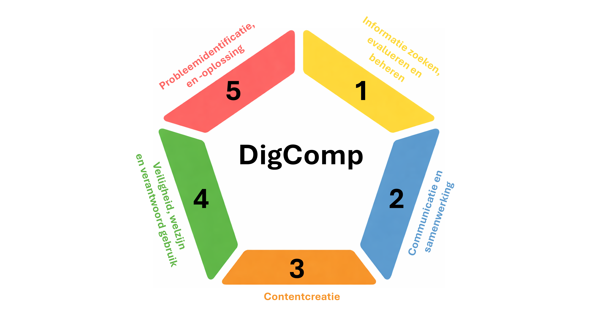



# Colofon {#sec-colofon .unnumbered}

**Originele bron:** Cosgrove, J. and Cachia, R., *DigComp 3.0: European Digital Competence Framework - Fifth Edition*, Publications Office of the European Union, Luxembourg, 2025, https://data.europa.eu/doi/10.2760/0001149, JRC144121.

De Europese Commissie is niet verantwoordelijk voor deze vertaalde versie en de bijbehorende databestanden die in het Nederlands beschikbaar zijn. De Europese Commissie staat de vertaling van DigComp 3.0 in andere talen toe, maar onderschrijft de gewijzigde, aangepaste of vertaalde versies niet.

Het hergebruikbeleid van de documenten van de Europese Commissie wordt beschreven in Besluit 2011/833/EU. Tenzij anders vermeld, is hergebruik van het originele DigComp-document toegestaan onder de CC BY 4.0 licentie.

De vertaling naar het Nederlands is uitgevoerd onder auspiciën van het iXperium Centre of Expertise Teaching and Learning. Er zijn geen wijzigingen aangebracht in de originele competentiegebieden, behalve een vertaling waarbij de intentie zo dicht mogelijk bij het origineel is gebleven.

Maak bij gebruik van deze vertaling vermelding van de volgende referentie: Gorissen, P. & van Zanten, M. (2026). *DigComp 3.3: Europees kader voor digitale competenties*. iXperium Centre of Expertise Leren met ict.

[Standaard CC-BY logo iXperium invoegen]{.mark}

## Over deze vertaling {#sec-over-vertaling .unnumbered}

Deze Nederlandse vertaling beperkt zich tot de belangrijkste onderdelen van de DigComp 3.0. De vertaling bevat een Inleiding op basis van de Engelse tekst, het DigComp 3.0 raamwerk, de competentiegebieden en competenties, beheersingsniveaus en leeruitkomsten. Daarnaast zijn via ixperium.nl twee extra bestanden beschikbaar: een Excelbestand en een JSON-D bestand geschikt voor programmatische verwerking van de onderdelen van de DigComp 3.0.



# Inleiding {#sec-inleiding}

## Over DigComp 3.0 {#sec-over-digcomp-3.0 .unnumbered}

DigComp 3.0 is de vijfde editie van het Europese Digitale competentie-raamwerk. Het raamwerk beschrijft kennis, vaardigheden en houdingen die nodig zijn om digitaal bekwaam te zijn voor het dagelijks leven, deelname aan de samenleving, werken en leren. Het raamwerk is technologie-neutraal en ontworpen om op maat gemaakt te worden voor verschillende onderwijs- en arbeidscontexten.

Het raamwerk ondersteunt EU-beleidslijnen zoals De Vaardigheidsunie (*Union of Skills*) en het Beleidsprogramma voor het digitale decennium (*Digital Decade Policy Programme*). DigComp 3.0 bevat ontwikkelingen die sinds 2022 hebben plaatsgevonden, inclusief de integratie van AI-competenties.

Het raamwerk is ontwikkeld met input van een groot aantal experts en organisaties. Zie de Engelstalige versie voor een uitgebreide omschrijving van de betrokkenen en het ontwikkelproces.

## Het belang van Digitale Competentie {.unnumbered}

Digitale omgevingen zijn verweven met het dagelijks leven, wat zowel voordelen als risico’s met zich meebrengt. Het is essentieel om tekorten in vaardigheden te overbruggen. Digitale competenties bieden individuen voordelen zoals het gebruik van publieke platforms, privacybeheer en welzijn [@MorteNadal2025; @Pouliakas2025; @Stalmach2023; @Tarca2024], en vormen een middel om sociale uitsluiting aan te pakken [@Boerkamp2024; @Brundle2025] en de concurrentiekracht te versterken [@Draghi2024; @Pakhnenko2025]. In beleid en initiatieven worden 'digitale vaardigheden' en 'digitale competentie' vaak door elkaar gebruikt. In DigComp 3.0 wordt de term 'digitale competentie' gebruikt om kennis, vaardigheden en houdingen te omvatten. Digitale competentie (enkelvoud) gaat over het digitaal competent zijn. De digitale competenties (meervoud) beschrijven wat het betekent om digitaal competent te zijn.

## Digitale feiten en cijfers {.unnumbered}

| Kinderen en jongeren | Volwassenen in het algemeen | Werkenden |
|:-----------------------|:-----------------------|:-----------------------|
| 43% van de leerlingen bereikte in 2023 geen basisniveau [@Duckworth2025]. | 56% van de volwassenen beschikte in 2023 over digitale basisvaardigheden [@Commission2025b]. | 92% van de werknemers gebruikte in 2024-2025 digitale apparaten [@Eurostat2025]. |
| 96% van de 15-jarigen gebruikte in 2022 dagelijks sociale media [@Commission2025a]. | 70% van de volwassenen had in 2024 digitale interactie met de overheid [@Commission2025b]. | 30% van de werknemers gebruikte AI-systemen op het werk in 2024-2025 [@Pouliakas2025]. |
| 14%-16% was slachtoffer van cyberpesten in 2022 [@Commission2025a]. | 49% meldde in 2023 onjuiste inhoud op sociale media [@Commission2025b]. | 35% moest in 2020-2021 nieuwe technologie leren voor werk [@Commission2023b]. |
| 9-12% rapporteerde problematisch gebruik van sociale media [@Commission2025a]. | 58% zocht in 2022 naar gezondheidsinformatie [@Commission2025b]. | 42% rapporteerde in 2024 een kloof in AI-vaardigheden [@Pouliakas2025]. |

: Digitale competentie – een selectie van feiten en cijfers. {#tbl-stats}

@tbl-stats illustreert enkele implicaties van digitale technologie voor digitale competentie bij kinderen en jongeren, volwassenen in het algemeen en werknemers aan de hand van een selectie van statistisch bewijs uit recente enquêtes.

[NB Paragraaf 1.2 "European initiatives to support digital competence" bewust niet opgenomen in deze vertaling.]{.mark}

## Adoptie en gebruik van DigComp {#sec-adoptie-en-gebruik-van-digcomp .unnumbered}

Een belangrijk kenmerk van DigComp is de mate waarin experts en belanghebbenden uit Europa en daarbuiten bijdragen aan de ontwikkeling ervan. Dit helpt de kwaliteit en relevantie te waarborgen en ondersteunt de adoptie ervan. DigComp wordt veelvuldig gebruikt in Europa en daarbuiten in contexten van werkgelegenheid, onderwijs en opleiding [@Centeno2024b; @Centeno2025; @Kluzer2020] en vormt de conceptuele basis van de Digital Skills Indicator^[zie: https://ec.europa.eu/eurostat/cache/metadata/en/isoc_sk_dskl_i21_esmsip2.htm] (DSI) [@Vuorikari2022b], die wordt gebruikt om het niveau van digitale basisvaardigheden in Europa te monitoren via het beleidsprogramma voor het digitale decennium ^[zie: https://digital-strategy.ec.europa.eu/en/policies/digital-decade-policy-programme]. Naast het bieden van een gemeenschappelijk begrip van digitale competentie, wordt DigComp onder andere gebruikt om Europees, nationaal en regionaal beleid te sturen; beoordelingen te ontwikkelen; de transparantie of vergelijkbaarheid van onderwijs- en opleidingscursussen te verbeteren; leerprestaties te erkennen of te valideren (bijvoorbeeld door certificering van digitale vaardigheden); en profielen van digitale competentie in specifieke banen of rollen te definiëren.

## Waarden en principes die richting geven aan DigComp 3.0 {#sec-waarden-en-principes .unnumbered}

De visie voor DigComp 3.0 is dat het een verenigend, coherent, helder, relevant en actueel beeld geeft van digitale competentie dat voortbouwt op eerdere versies, en dat kan worden gebruikt door een verscheidenheid aan belanghebbenden die het gemeenschappelijke doel delen om behoeften op het gebied van digitale competentie te begrijpen en te herkennen en de ontwikkeling ervan te ondersteunen. DigComp 3.0, de vijfde editie van het kader, blijft het belangrijkste referentiekader voor digitale competentie in de EU. Digitale competentie is een van de acht sleutelcompetenties van de aanbeveling van de Raad inzake sleutelcompetenties voor een leven lang leren ^[zie: https://eur-lex.europa.eu/legal-content/EN/TXT/?uri=uriserv:OJ.C_.2018.189.01.0001.01.ENG&toc=OJ:C:2018:189:TOC] [@Commission2018].
*Kerncompetenties* zijn de kennis, vaardigheden en houdingen die iedereen nodig heeft voor persoonlijke ontplooiing en ontwikkeling, inzetbaarheid op de arbeidsmarkt, sociale inclusie en actief burgerschap.
DigComp 3.0 belichaamt de waarden van de Europese verklaring over digitale rechten en beginselen voor het digitale decennium ^[zie: https://digital-strategy.ec.europa.eu/en/policies/declaration-digital-rights-and-principles] [@Commission2023a], die een mensgerichte visie op de digitale transformatie bevordert. Het raamwerk is georganiseerd in zes competentiedomeinen (zie @tbl-waarden). De verklaring bouwt voort op het EU-Handvest van de grondrechten van de EU ^[zie: https://fra.europa.eu/en/eu-charter/charter-of-fundamental-rights] [@Commission2012].

::: {#tbl-waarden .bordered tbl-colwidths="[30,70]"}
|                                |                                                                                                                                                                                                                                                |
|--------------------------------|------------------------------------------------------------------------------------------------------------------------------------------------------------------------------------------------------------------------------------------------|
| **Mensen centraal**            | Digitale technologie moeten de rechten van mensen beschermen, de democratie ondersteunen en ervoor zorgen dat alle digitale actoren verantwoordelijk en veilig handelen. De EU promoot deze waarden over de hele wereld.                       |
| **Solidariteit en inclusie**   | Technologie moet mensen verenigen, niet verdelen. Iedereen moet toegang hebben tot internet, tot digitale vaardigheden, tot digitale overheidsdiensten en tot eerlijke arbeidsomstandigheden.                                                  |
| **Vrijheid van keuze**         | Mensen moeten kunnen profiteren van een eerlijke online omgeving, veilig zijn voor illegale en schadelijke inhoud, en in hun kracht worden gezet wanneer ze interageren met nieuwe en evoluerende technologie zoals kunstmatige intelligentie. |
| **Participatie**               | Burgers moeten kunnen deelnemen aan het democratische proces op alle niveaus en controle hebben over hun eigen gegevens.                                                                                                                       |
| **Veiligheid en beveiliging**  | De digitale omgeving moet veilig en betrouwbaar zijn. Alle gebruikers, van kind tot op hoge leeftijd, moeten worden gesterkt en beschermd.                                                                                                     |
| **Duurzaamheid**               | Digitale apparaten moeten duurzaamheid en de groene transitie ondersteunen. Mensen moeten weten wat de milieu-impact en het energieverbruik van hun apparaten zijn.                                                                            |

: De zes thema's van de Europese verklaring over digitale rechten en beginselen [@Commission2023a].
:::

*Bron: Gebaseerd op https://digital-strategy.ec.europa.eu/en/factpages/digital-rights-and-principles*

## Wat is er nieuw in DigComp 3.0? {#sec-wat-is-er-nieuw-in-digcomp-3.0 .unnumbered}

Verschillende belangrijke thema's met betrekking tot de inhoud (d.w.z. waaruit digitale competentie bestaat) en toepassing (d.w.z. hoe het raamwerk wordt aangepast en gebruikt en de rol ervan in onderwijs, opleiding en werkgelegenheidssystemen) gaven richting aan de ontwikkeling van DigComp 3.0 (@tbl-themas). Deze werden geïdentificeerd op basis van beleids- en academische literatuur en overleg met experts en belanghebbenden en zijn holistisch ingebed in de inhoud en het ontwerp van het raamwerk.

::: {#tbl-themas .bordered}
|                                                                        |
|------------------------------------------------------------------------|
| **Inhoudsthema's**                                                     |
| Kunstmatige intelligentie (inclusief generatieve AI) competentie       |
| Cyberbeveiliging competentie                                           |
| Digitale rechten, keuze en verantwoordelijkheden                       |
| Welzijn in digitale omgevingen                                         |
| Competentie om misinformatie en desinformatie aan te pakken            |
| **Toepassingsthema's**                                                 |
| Digitale competentie als essentieel onderdeel van een leven lang leren |
| Erkenning van randvoorwaarden voor het verwerven van digitale competentie op basisniveau |
| Erkenning van verschillen in behoeften aan digitalecompetentie tussen personen en door de tijd heen |
| Behoefte aan flexibele, wendbare toepassingen van het kader |

: Inhouds- en toepassings- thema's die richting geven aan DigComp 3.0 ontwikkeling.
:::

*Bron: Eigen bewerking door JRC.*

@tbl-doelen vat de doelstellingen en belangrijkste kenmerken van de DigComp 3.0-update samen. De update van DigComp wordt gedreven door aanzienlijke technologische ontwikkelingen, trends en praktijken (zoals de snelle verspreiding van generatieve AI) die hebben plaatsgevonden sinds de publicatie van DigComp 2.2 in 2022. Deze hebben verreikende implicaties voor de digitale competenties van individuen en komen tot uiting in beleidsprioriteiten en zorgen van belanghebbenden [@Abendroth-Dias2025; @FariasGaytan2023; @Lewandowsky2020; @OnesiOzigagun2024]. DigComp 3.0 reageert ook op verzoeken van bestaande gebruikers en belanghebbenden, die meer duidelijkheid wensten over praktische toepassingen van DigComp. Een belangrijke aanbeveling in een studie naar de haalbaarheid van een Europees certificaat voor digitale vaardigheden, waarbij 650 belanghebbenden uit alle EU-lidstaten betrokken waren, was om leerresultaten voor DigComp te ontwikkelen [@Centeno2024a].

::: {#tbl-doelen .bordered}
| Categorie | Details |
|:-----------------------------------|:-----------------------------------|
| **DOELSTELLINGEN** | 1\. Integreer recente en opkomende digitale technologische trends en hun implicaties voor digitale competentie, terwijl de algemene structuur van het raamwerk en technologische neutraliteit behouden blijven. |
|  | 2\. Ontwikkeling van leerresultaten and andere passende verbeteringen ter ondersteuning van duidelijkheid en operationele afstemming in de toepassing van DigComp. |
| **WIJZIGINGEN EN ONTWIKKELINGEN** | • Updates aan de bewoordingen van de vijf competentiegebieden en 21 competenties om de huidige technologische trends te weerspiegelen. |
|  | • Een nieuwe algemene beschrijving van beheersingsniveaus (Basis, Gevorderd, Geavanceerd en Zeer geavanceerd) die aan de vorige versie kunnen worden gekoppeld, en nieuwe en herziene competentiebeschrijvingen voor elk beheersingsniveau en competentie. |
|  | • Ontwikkeling van leerresultaten, voor een duidelijkere interpretatie en implementatie. |
|  | • Een systematische, transversale integratie van AI-competentie in het raamwerk die voortbouwt op DigComp 2.2, en daarnaast recente ontwikkelingen met betrekking tot AI omvat. |
| **HULPMIDDELEN VOOR IMPLEMENTATIE** | • [Een gedetailleerde woordenlijst met circa 120 kerntermen in dit document.]{.mark} |
|  | • [Duidelijke en gebruiksvriendelijke informatie over DigComp 3.0 op de JRC-DigComp-webruimte.]{.mark} |
|  | • [Ook op de JRC-DigComp-webruimte zijn versies van DigComp 3.0 beschikbaar in spreadsheet- en linked open data (JSON) indelingen.]{.mark} |

: DigComp 3.0: doelstellingen, ontwikkelingen en middelen voor implementatie.
:::

*Bron: eigen bewerking JRC.*

## DigComp 3.0 gebruiken {#sec-digcomp-3.0-gebruiken .unnumbered}

DigComp 3.0 is niet-voorschrijvend en is bedoeld om te worden aangepast aan specifieke toepassingen en behoeften. DigComp is ontworpen om initiatieven en acties te sturen en te inspireren die de ontwikkeling van digitale competentie van individuen ondersteunen, zowel in het algemeen (zoals in algemene beleidsvorming) als bij specifieke groepen (zoals jonge lerenden, volwassen lerenden, kwetsbare of gemarginaliseerde individuen, werknemers of werkzoekenden). Als zodanig moet het worden beschouwd als een startpunt, dat moet worden aangepast aan een specifiek doel.
De nu volgende onderdelen van dit document beschrijven het raamwerk zelf in meer detail.



# Componenten van het DigComp 3.0 raamwerk {#sec-digcomp-3.0-raamwerkcomponenten}

## Overzicht {#sec-overzicht}

@tbl-componenten beschrijft de componenten van DigComp 3.0 en hun doeleinden: definitie van digitale competentie, competentiegebieden, competenties, niveaus van bekwaamheid en leerresultaten.

::: {#tbl-componenten tbl-colwidths="[25,75]"}

| Component | Beschrijving en doel |
|:-----------------------------------|:-----------------------------------|
| **Definitie van digitale competentie** | Stelt de inhoud en de reikwijdte van het kader vast, maakt onderscheid tussen kennis, vaardigheden en houdingsaspecten van digitale competentie, en plaatst het kader in de bredere context van sleutelcompetenties voor een leven lang leren. Zie @sec-definitie-van-digitale-competentie. |
| **Competentiegebieden** | Organiseert competenties in vijf thematische groepen, bestaande uit namen (titels) van competentiegebieden en descriptoren (korte beschrijvingen van de competenties die in elk competentiegebied vallen). Zie @sec-competentiegebieden-en-competenties. |
| **Competenties** | Definieert 21 competenties, georganiseerd onder de vijf competentiegebieden, bestaande uit competentienamen (titels) en descriptoren (korte beschrijvingen van waaruit elke competentie bestaat). Zie @sec-competentiegebieden-en-competenties. |
| **Beheersingsniveaus** | Stelt een continuüm van beheersing vast op basis van cognitieve belasting, taakcomplexiteit en mate van autonomie. Algemene beheersingsniveaus (zie @sec-beheersingsniveaus) beschrijven digitale competentie op de niveaus Basis, Gemiddeld, Gevorderd en Zeer gevorderd. Competentiebeschrijvingen (zie @sec-raamwerk) bieden een gedetailleerder beeld van de beheersingsniveaus voor elk van de 21 competenties. |
| **Leerresultaten** | Leerresultaten (zie @sec-leerresultaten) bieden het meest gedetailleerde ('granulaire') beeld van het raamwerk en bestaan uit verklaringen over wat een individu geacht wordt te weten of te kunnen na voltooiing van het leerproces (van welke aard dan ook). Elk van de leerresultaten is geclassificeerd naar competentie, beheersingsniveau en kennis, vaardigheid of houding. Leerresultaten zijn ontwikkeld om een concrete en consistente interpretatie van het raamwerk mogelijk te maken. |

: Componenten van het DigComp 3.0 raamwerk

:::
*Bron: Eigen bewerking door JRC.*

## Definitie van Digitale Competentie {#sec-definitie-van-digitale-competentie}

De aanbeveling over sleutelcompetenties voor levenslang leren (Europese Commissie, 2018) definieert digitale competentie van zowel kinderen als volwassenen, als: **…het zelfverzekerd, kritisch en verantwoord gebruik van, en betrokkenheid bij, digitale technologie voor leren, op het werk, en voor deelname aan de samenleving. Het omvat informatie- en data-vaardigheden, communicatie en samenwerking, mediawijsheid, creatie van digitale content (waaronder programmeren), veiligheid (waaronder digitaal welzijn en competenties met betrekking tot cybersecurity), vraagstukken met betrekking tot intellectueel eigendom, probleemoplossing en kritisch denken.* [@Commission2018]

Competenties worden gedefinieerd als een combinatie van kennis, vaardigheden en houdingen, waarbij:

-   **Kennis** bestaat uit de feiten en cijfers, concepten, ideeën en theorieën die reeds vaststaan en het begrip van een bepaald gebied of onderwerp ondersteunen;

-   **Vaardigheden** worden gedefinieerd als de bekwaamheid en capaciteit om processen uit te voeren en de bestaande kennis te gebruiken om resultaten te bereiken; en

-   **Houdingen (attitudes)** beschrijven de instelling en denkwijzen om te handelen of te reageren op ideeën, personen of situaties.

DigComp 3.0 blijft in lijn met deze algemene definitie, terwijl het tegelijkertijd recente en opkomende trends en prioriteiten weerspiegelt.

## Competentiegebieden en competenties {#sec-competentiegebieden-en-competenties}

@fig-competentiegebieden-en-competenties laat zien hoe de competenties zijn gegroepeerd in de competentiegebieden, terwijl @tbl-comp-geb-beschrijvingen de descriptoren voor elk competentiegebied en elke competentie weergeeft.

::: {#fig-competentiegebieden-en-competenties}

 

Competentiegebieden en competenties van DigComp 3.0
:::
*Bron: Eigen bewerking door JRC.*

[dit kan natuurlijk beter - zie het als een placeholder - in de Engelse versie is dit Figure 5 op pagina 17]{.mark}

::: {#tbl-comp-geb-beschrijvingen}

|   |
|---|
|   |

:   DigComp 3.0 competentiegebieden, competenties, beschrijvingen 

:::

[tabel table_2]

[tabel 2 is ook als los .docx-bestand beschikbaar: DigComp3_table2_nl.docx]{.mark}

## Beheersingsniveaus {#sec-beheersingsniveaus}

### Beschrijvingen van beheersingsniveaus {.unnumbered}

In DigComp 3.0 beschrijven de beheersingsniveaus het niveau van verwerving van digitale competentie van een individu op basis van een combinatie van cognitieve inspanning, taakcomplexiteit en mate van autonomie. DigComp 3.0 maakt onderscheid tussen vier beheersingsniveaus (Basis, Gemiddeld, Geavanceerd en Zeer Geavanceerd). @tbl-beheersingsniveaus geeft een korte beschrijving van wat een individu geacht wordt te weten en te kunnen op elk van de vier niveaus en de doelen die elk van de vier niveaus dient.

::: {#tbl-beheersingsniveaus tbl-colwidths="[20,40,40]"}

| Beheersingsniveau | Korte beschrijving van competentieverwerving | Doel |
|:-----------------------|:-----------------------|:-----------------------|
| **Basis** | Op basisniveau onthouden en voeren personen eenvoudige taken uit met begeleiding waar nodig. | Om persoonlijke, leer- en/of werkdoelen te ondersteunen en deel te nemen aan de samenleving. |
| **Gemiddeld** | Op gemiddeld niveau identificeren en voeren personen welgedefinieerde taken uit en lossen ze welgedefinieerde problemen autonoom op. | Om persoonlijke, leer- en/of werkdoelen te ondersteunen en autonoom deel te nemen aan de samenleving. |
| **Geavanceerd** | Op geavanceerd niveau beoordelen en passen personen autonoom oplossingen toe op een verscheidenheid aan complexe taken en passen ze zich aan diverse contexten aan om taken adequaat te evalueren en uit te voeren, waarbij ze anderen begeleiden indien en wanneer nodig. | Om persoonlijke, leer- en/of werkdoelen te ondersteunen, effectief deel te nemen aan de samenleving en anderen te managen of te ondersteunen bij het bereiken van hun doelen. |
| **Zeer geavanceerd** | Op zeer geavanceerd niveau beoordelen, evalueren en lossen personen zeer complexe of gespecialiseerde problemen op om nieuwe oplossingen te creëren of bestaande aan te passen, waarbij ze anderen leiden en begeleiden indien en wanneer nodig. | Om persoonlijke, leer- en/of werkdoelen te ondersteunen, anderen te helpen effectief deel te nemen aan de samenleving, anderen te leiden of te ondersteunen bij het bereiken van complexe doelen, en/of leiding te geven aan of bij te dragen aan verbeteringen in of nieuwe oplossingen voor zeer complexe problemen. |

: DigComp 3.0 Beheersingsniveau beschrijvingen en doeleinden

:::
*Bron: Eigen bewerking door JRC.*

Elk van de vier beheersingsniveaus van DigComp 3.0 omvat (1) een korte beschrijving van competentieverwerving en (2)  de doelen die elk niveau kan dienen. Het is belangrijk om te erkennen dat de behoeften aan digitale competentie variëren per individu en kunnen veranderen in de loop van de tijd, als gevolg van levensfasen en technologische ontwikkelingen. Een **taak** is een specifieke activiteit waarbij digitale technologie worden gebruikt die bijdragen aan een doel, in welke context dan ook – het dagelijks leven, werk of leren. Taken kunnen variëren in omvang, duur en complexiteit en kunnen individueel of in samenwerking met anderen worden uitgevoerd. Taken kunnen variëren van eenvoudig tot complex. Een **eenvoudige taak** in DigComp 3.0 is een taak die goed gedefinieerd is, uit weinig onderdelen bestaat en gemakkelijk te begrijpen en te voltooien is. Een **complexe taak** daarentegen is een taak die niet goed gedefinieerd is, uit veel verschillende en onderling verbonden onderdelen bestaat en daarom ingewikkeld en niet gemakkelijk te begrijpen of te voltooien is. De complexiteit van een taak wordt vaak alleen beschreven op basis van taakkenmerken, maar de ervaring en kenmerken van een individu die een taak uitvoert, zijn ook relevant [@Chen2023]. Op de niveaus **Geavanceerd** en **Zeer Geavanceerd** van digitale competentie kunnen individuen naast digitale competenties ook putten uit ervaring en/of gespecialiseerde kennis om taken te voltooien. Hier verwijzen gespecialiseerde kennis en vaardigheden naar competenties die betrekking hebben op een bepaalde discipline, vakgebied of terrein.

[2.4.2 PRE-REQUISITES OF BASIC-LEVEL DIGITAL COMPETENCE - pagina 21 is bewust niet opgenomen in de vertaling]{.mark}

## Leerresultaten {#sec-leerresultaten}

::: {.callout-note}
Leerresultaten in DigComp 3.0 zijn uitspraken over wat een individu weet, begrijpt of kan na voltooiing van een leerproces, en ze worden gedefinieerd in termen van kennis, vaardigheden en houding.
:::

::: {.callout-note}
De term 'leerresultaten' in DigComp 3.0 verwijst naar beoogde, niet naar behaalde leerresultaten.
:::

Voor de ontwikkeling van DigComp 3.0 heeft het JRC, met input van experts en belanghebbenden, zorgvuldig de balans tussen specificiteit en algemeenheid afgewogen om ervoor te zorgen dat de formulering van de leerdoelen voldoende algemeen is om in verschillende contexten te kunnen worden toegepast, en tegelijkertijd voldoende precies is om duidelijk en ondubbelzinnig te zijn.
De kenmerken van de DigComp 3.0-leerresultaten, praktische overwegingen voor het gebruik ervan en de volledige set DigComp 3.0-leerresultaten zelf zijn te vinden in @sec-leerresultaten. Daar zijn de leerresultaten gegroepeerd per competentie, beheersingsniveau en kennis, vaardigheid of houding. In totaal zijn er 523 leerresultaten: 29% (151) bevindt zich op het Basisniveau, 32% (170) Gemiddeld, 23% (119) Geavanceerd en 16% (83) Zeer Geavanceerd. Bovendien hebben 42% (217) van de leerresultaten betrekking op kennis, 38% (199) op vaardigheden en 20% (107) op houdingen. @sec-raamwerk bevat de competentiebeschrijvingen voor elke competentie en elk beheersingsniveau. De competentiebeschrijvingen bevatten de inhoud van de leerresultaten in [bijlage 2]{.mark}, met veel overeenkomsten in bewoording, maar maken geen onderscheid tussen kennis, vaardigheden of houdingen.

Leerresultaten zijn een belangrijk beleidsinstrument en een praktisch hulpmiddel. Indien goed gebruikt, fungeren ze als de 'lijm' die onderwijs en opleiding verbindt met de arbeidsmarktcontext [@Cedefop2024a]. Ze beïnvloeden beleid, onderwijs, opleiding, beoordeling en de arbeidsmarkt op verschillende manieren – om de ontwikkeling, implementatie en herziening van het curriculum of de cursusinhoud te sturen; als referentiepunt voor de erkenning en validatie van formeel, niet-formeel en informeel leren; om kwalificatiekaders en standaarden te definiëren en te informeren; om summatieve en formatieve beoordeling te ondersteunen; om belangrijke arbeidsvaardigheden aan te geven in beroepsprofilering; en om bij te dragen aan sectorale behoefteanalyse [@Cedefop2017, @Cedefop2022, @Cedefop2024a].

Het is belangrijk om onderscheid te maken tussen beoogde en behaalde leerresultaten. Beoogde leerresultaten zijn uitspraken over wat een individu naar verwachting zal weten, begrijpen of kunnen na voltooiing van een leerproces. Ze hebben betrekking op principes en concepten en kunnen worden waargenomen in curricula, kwalificatiebeschrijvingen en standaarden. Behaalde leerresultaten zijn wat een individu kan aantonen na voltooiing van een leerproces. Ze zijn gerelateerd aan de praktijk en zijn het resultaat van een onderwijs- of opleidings- en beoordelingsproces [@Cedefop2022]. Voor de ontwikkeling van DigComp 3.0 heeft het JRC, met input van experts en belanghebbenden, zorgvuldig gekeken naar de balans tussen specificiteit en algemeenheid om ervoor te zorgen dat de bewoordingen van de leerresultaten voldoende generiek zijn om in verschillende contexten te worden toegepast, terwijl ze tegelijkertijd voldoende nauwkeurig zijn om helder en ondubbelzinnig te zijn.

## AI-competentie in DigComp 3.0 {#ai-competentie}

DigComp 3.0 bouwt voort op het initiële werk van DigComp 2.2 door systematisch de aspecten van AI-competentie op te nemen die relevant zijn voor individuen om te ontwikkelen als onderdeel van hun digitale competentie. AI-competentie is verweven met en bouwt voort op andere elementen van digitale competentie, aangezien AI-systemen wijdverspreid zijn en steeds vaker ingebed zijn in bestaande digitale technologie. In DigComp 3.0 wordt AI gepresenteerd als één digitale technologie te midden van een reeks digitale technologie, terwijl de focus op de digitale competenties zelf blijft liggen.

Er zijn verschillende definities en analyses van AI-geletterdheid voorgesteld in de literatuur [@Touretzky2019, @Touretzky2023, @Long2020, @Ng2021]; wetgeving (de AI-verordening van 2024, Verordening (EU) 2024/1689); recente kaders voor AI-geletterdheid [bijv. @OECD2025, @Mills2024, @UNESCO2022]; en beleidsrapporten  [bijv. @Miao2024, @DiVinadio2022]. Deze verschillende bronnen leggen de nadruk op conceptueel begrip van wat AI is (en wat niet), contexten voor de toepassing ervan, en kritische, ethische en verantwoorde benaderingen voor het gebruik van AI. Deze kenmerken komen terug in DigComp 3.0.
Om te waarborgen dat AI-competentie goed geïntegreerd is in DigComp 3.0, heeft het JRC samen met experts een evaluatie uitgevoerd van recente en opkomende digitale technologietrends en een inventarisatie gemaakt van de competenties van het (ontwerp)kader voor AI-geletterdheid van de Europese Commissie en de OESO [@OECD2025] en DigComp 3.0.

In DigComp 3.0 definiëren we AI volgens de AI-verordening (artikel 3, lid 1):

::: {.callout-note}
...een op een machine gebaseerd systeem dat is ontworpen om te werken met variërende niveaus van autonomie, dat na de uitrol aanpassingsvermogen kan vertonen en dat, voor expliciete of impliciete doelstellingen, uit de ontvangen input afleidt hoe output moet worden gegenereerd, zoals voorspellingen, inhoud, aanbevelingen of beslissingen die fysieke of virtuele omgevingen kunnen beïnvloeden. Deze definitie hanteert een levenscyclusperspectief en omvat zowel de fase vóór de uitrol als de uitrol zelf^[Zie de [richtlijnen voor de definitie van een kunstmatig intelligentiesysteem](https://digital-strategy.ec.europa.eu/en/library/commission-publishes-guidelines-ai-system-definition-facilitate-first-ai-acts-rules-application) voor meer informatie [@Commission2025f].].
:::

In DigComp 3.0 worden de termen 'AI' en 'AI-systeem' in hun brede betekenis gebruikt en omvatten ze generatieve AI(-systemen). Er wordt echter in DigComp 3.0 naar generatieve AI verwezen wanneer dit van centraal belang wordt geacht voor een competentie. In DigComp 3.0 wordt generatieve AI gedefinieerd als een subset van AI die gebruikmaakt van gespecialiseerde machine learning-modellen die zijn ontworpen om een brede en algemene

Competentiebeschrijvingen die expliciet AI-systemen noemen, zijn gelabeld als ‘\[AI-E\]’ (AI-expliciet), terwijl verklaringen waarvoor AI of AI-systemen impliciet relevant zijn maar die AI-systemen niet expliciet noemen, zijn gelabeld als ‘\[AI-I\]’ (AI-impliciet). Op vergelijkbare wijze zijn individuele leerresultaten gelabeld als AI-expliciet, AI-impliciet of AI noch impliciet noch expliciet.

[Box 3. Explicit and implicit AI competence in DigComp 3.0 is niet opgenomen in deze vertaling.]{.mark}



# DigComp 3.0 raamwerk {#sec-raamwerk}

## Hoe moet je het raamwerk lezen?

[Hier moet een mooi plaatje komen met hoe je de tabel die volgt moet lezen, vergelijkbaar met pagina 9 van de vorige keer.]{.mark}

## DigComp 3.0

::: {#tbl-digcomp3}

|   |
|---|
|   |

: DigComp 3.0

:::

[tabel digcomp3]

[tabel digcomp3 is ook als los .docx-bestand beschikbaar: DigComp3_digcomp3_nl.docx]{.mark}

# DigComp 3.0 leerresultaten {#sec-bijlage-leerresultaten}

::: {#tbl-outcomes}

|   |
|---|
|   |

: DigComp 3.0 leerresultaten

:::

[tabel outcomes]

[tabel outcomes is ook als los .docx-bestand beschikbaar: DigComp3_outcomes_nl.docx]{.mark}

[De tabel zelf is A2.3 in het origineel, paragraaf A2.1 Features en A2.2 zijn nog niet opgenomen. Naar de leerresultaten - hoewel ze in deze versie nog echt niet goed zijn - is expliciet gevraagd.]{.mark}



# DigComp 3.0 woordenlijst {#sec-woordenlijst}

::: {#tbl-woordenlijst}

|   |
|---|
|   |

: DigComp 3.0 woordenlijst

:::

[tabel glossary]

[tabel glossary is ook als los .docx-bestand beschikbaar: DigComp3_glossary_nl.docx]{.mark}

[waarschijnlijk gaat deze tabel sneuvelen als het simpelweg te duur wordt om op te nemen]{.mark}



# Aanvullende bronnen 

[Hier moet nog uitleg over de Excel en de JSON-D die ook te downloaden zijn van de iXperium website]{.mark}



# Literatuur {.unnumbered}

::: {#refs}
:::