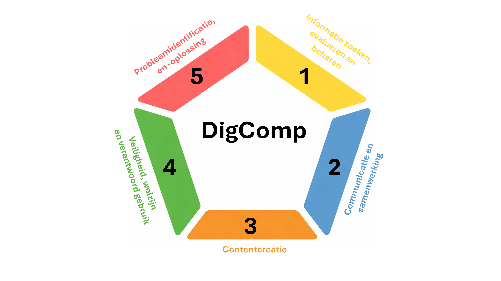



# Colofon {#sec-colofon .unnumbered}

**Originele bron:** Cosgrove, J. and Cachia, R., *DigComp 3.0: European Digital Competence Framework - Fifth Edition*, Publications Office of the European Union, Luxembourg, 2025, https://data.europa.eu/doi/10.2760/0001149, JRC144121.

De Europese Commissie is niet verantwoordelijk voor deze vertaalde versie en de bijbehorende databestanden die in het Nederlands beschikbaar zijn. De Europese Commissie staat de vertaling van DigComp 3.0 in andere talen toe, maar onderschrijft de gewijzigde, aangepaste of vertaalde versies niet.

Het beleid voor het hergebruik van de documenten van de Europese Commissie wordt beschreven in Besluit 2011/833/EU. Tenzij anders vermeld, is hergebruik van het originele DigComp-document toegestaan onder de CC BY 4.0 licentie.

De vertaling naar het Nederlands is uitgevoerd onder auspiciën van het iXperium Centre of Expertise Teaching and Learning (iXperium). Er zijn geen wijzigingen aangebracht in de originele competentiegebieden, behalve een vertaling waarbij de intentie zo dicht mogelijk bij het origineel is gebleven.

Maak bij gebruik van deze vertaling vermelding van de volgende referentie: Gorissen, P. & van Zanten, M. (2026). *DigComp 3.0: Europees kader voor digitale competenties*. iXperium Centre of Expertise Leren met ict.

[Standaard CC-BY logo iXperium invoegen]{.mark}

## Over deze vertaling {#sec-over-vertaling .unnumbered}

Deze Nederlandse vertaling beperkt zich tot de belangrijkste onderdelen van de DigComp 3.0. De vertaling bevat een Inleiding op basis van de Engelse tekst, het DigComp 3.0 raamwerk, de competentiegebieden en competenties, beheersingsniveaus en leeruitkomsten. Daarnaast zijn via de website van iXperium twee extra bestanden beschikbaar op basis van de bronbestanden: een Excelbestand en een JSON-D bestand geschikt voor programmatische verwerking van de onderdelen van de DigComp 3.0.



# Inleiding {#sec-inleiding}

## Over DigComp 3.0 {#sec-over-digcomp-3.0 .unnumbered}

DigComp 3.0 is de vijfde editie van het Europese Digitale competentieraamwerk. Het raamwerk beschrijft kennis, vaardigheden en attitudes die nodig zijn om digitaal bekwaam te zijn voor het dagelijks leven, deelname aan de samenleving, werken en leren. Het raamwerk is technologieneutraal en ontworpen om op maat gemaakt te worden voor verschillende contexten binnen onderwijs en het werkveld.

Het raamwerk ondersteunt EU-beleidslijnen zoals de *Union of Skills* en het *Digital Decade Policy Programme*. DigComp 3.0 bevat ontwikkelingen die sinds 2022 hebben plaatsgevonden, zoals de opkomst van generatieve AI en de toename van het belang van AI-competenties binnen digitale competentie.

Het raamwerk is ontwikkeld met input van een groot aantal experts en organisaties. Zie de Engelstalige versie voor een uitgebreide omschrijving van de betrokkenen en het ontwikkelproces.

## Het belang van Digitale Competentie {.unnumbered}

Digitale technologieën en online platforms zijn inmiddels onlosmakelijk verweven met ons dagelijks leven, wat zowel voordelen als risico’s met zich meebrengt. Het is dan ook essentieel om tekorten in vaardigheden te overbruggen. Digitale competenties bieden individuen voordelen zoals een vlotter gebruik van publieke platforms, beter privacybeheer en meer welzijn [@MorteNadal2025; @Pouliakas2025; @Stalmach2023; @Tarca2024]. Ze vormen een middel om sociale uitsluiting aan te pakken [@Boerkamp2024; @Brundle2025] en de concurrentiekracht te versterken [@Draghi2024; @Pakhnenko2025]. In beleid en initiatieven worden "digitale vaardigheden" en "digitale competentie" vaak door elkaar gebruikt. In DigComp 3.0 wordt de term *digitale competentie* gebruikt om kennis, vaardigheden en attitudes te omvatten. Digitale competentie (enkelvoud) gaat over het digitaal competent zijn. De digitale competenties (meervoud) beschrijven wat het betekent om digitaal competent te zijn.

## Digitale feiten en cijfers {.unnumbered}

| Kinderen en jongeren | Volwassenen in het algemeen | Werkenden |
|:----------------------|:------------------------|:-----------------------|
| 43% van de leerlingen bereikte in 2023 geen basisniveau [@Duckworth2025]. | 56% van de volwassenen beschikte in 2023 over digitale basisvaardigheden [@Commission2025b]. | 92% van de werknemers gebruikte in 2024-2025 digitale apparaten [@Eurostat2025]. |
| 96% van de 15-jarigen gebruikte in 2022 dagelijks sociale media [@Commission2025a]. | 70% van de volwassenen had in 2024 digitale interactie met de overheid [@Commission2025b]. | 30% van de werknemers gebruikte AI-systemen op het werk in 2024-2025 [@Pouliakas2025]. |
| 14%-16% was slachtoffer van cyberpesten in 2022 [@Commission2025a]. | 49% meldde in 2023 onjuiste inhoud op sociale media [@Commission2025b]. | 35% moest in 2020-2021 nieuwe technologie leren voor werk [@Commission2023b]. |
| 9-12% rapporteerde problematisch gebruik van sociale media [@Commission2025a]. | 58% zocht in 2022 naar gezondheidsinformatie [@Commission2025b]. | 42% rapporteerde in 2024 een kloof in AI-vaardigheden [@Pouliakas2025]. |

: Digitale competentie – een selectie van feiten en cijfers. {#tbl-stats}

@tbl-stats illustreert enkele implicaties van digitale technologie voor digitale competentie bij kinderen en jongeren, volwassenen in het algemeen en werknemers aan de hand van een selectie van statistisch bewijs uit recente enquêtes.

[NB Paragraaf 1.2 "European initiatives to support digital competence" is bewust niet opgenomen in deze vertaling.]{.mark}

## Adoptie en gebruik van DigComp {#sec-adoptie-en-gebruik-van-digcomp .unnumbered}

Een belangrijk kenmerk van DigComp is de mate waarin experts en belanghebbenden uit Europa en daarbuiten bijdragen aan de ontwikkeling ervan. Dit waarborgt de kwaliteit en relevantie, en ondersteunt de adoptie van het raamwerk. DigComp wordt veelvuldig toegepast in Europa en daarbuiten binnen de context van werkgelegenheid, onderwijs en opleiding [@Centeno2024b; @Centeno2025; @Kluzer2020]. Het vormt de conceptuele basis van de Digital Skills Indicator[^1] (DSI) [@Vuorikari2022b], die via het beleidsprogramma voor het digitale decennium [^2] wordt gebruikt om het niveau van digitale basisvaardigheden in Europa te monitoren. Naast het bieden van een gemeenschappelijk begrip van digitale competentie, wordt DigComp onder andere gebruikt om:

[^1]: zie: https://ec.europa.eu/eurostat/cache/metadata/en/isoc_sk_dskl_i21_esmsip2.htm

[^2]: zie: https://digital-strategy.ec.europa.eu/en/policies/digital-decade-policy-programme

-   Europees, nationaal en regionaal beleid te sturen;

-   beoordelingen te ontwikkelen;

-   de transparantie of vergelijkbaarheid van onderwijs- en opleidingscursussen te vergroten;

-   leerprestaties te erkennen of te valideren (bijvoorbeeld via certificering);

-   en profielen van digitale competentie in specifieke banen of rollen te definiëren.

## Waarden en principes die richting geven aan DigComp 3.0 {#sec-waarden-en-principes .unnumbered}

De visie voor DigComp 3.0 is het bieden van een verenigend, coherent, helder, relevant en actueel beeld van digitale competentie. Het bouwt voort op eerdere versies en is bedoeld voor een verscheidenheid aan belanghebbenden die het gemeenschappelijke doel hebben: het begrijpen, herkennen en ondersteunen van de ontwikkeling van digitale competentie. Als vijfde editie blijft DigComp 3.0 het belangrijkste referentiekader voor digitale competentie in de EU. Het is een van de acht sleutelcompetenties van de aanbeveling van de Raad inzake sleutelcompetenties voor een leven lang leren [^3] [@Commission2018]. Deze kerncompetenties omvatten de kennis, vaardigheden en attitudes die iedereen nodig heeft voor persoonlijke ontplooiing en ontwikkeling, inzetbaarheid op de arbeidsmarkt, sociale inclusie en actief burgerschap.

[^3]: zie: https://eur-lex.europa.eu/legal-content/EN/TXT/?uri=uriserv:OJ.C\_.2018.189.01.0001.01.ENG&toc=OJ:C:2018:189:TOC

Daarnaast belichaamt DigComp 3.0 de waarden van de Europese verklaring over digitale rechten en beginselen voor het digitale decennium [^4] [@Commission2023a], die een mensgerichte visie op de digitale transformatie bevordert. Het raamwerk is georganiseerd in zes competentiedomeinen (zie @tbl-waarden) en bouwt voort op het EU-Handvest van de grondrechten van de EU [^5] [@Commission2012].

[^4]: zie: https://digital-strategy.ec.europa.eu/en/policies/declaration-digital-rights-and-principles

[^5]: zie: https://fra.europa.eu/en/eu-charter/charter-of-fundamental-rights

::: {#tbl-waarden .bordered tbl-colwidths="[30,70]"}
|  |  |
|------------------|------------------------------------------------------|
| **Mensen centraal** | Digitale technologie moeten de rechten van mensen beschermen, de democratie ondersteunen en ervoor zorgen dat alle digitale actoren verantwoordelijk en veilig handelen. De EU promoot deze waarden over de hele wereld. |
| **Solidariteit en inclusie** | Technologie moet mensen verenigen, niet verdelen. Iedereen moet toegang hebben tot internet, tot digitale vaardigheden, tot digitale overheidsdiensten en tot eerlijke arbeidsomstandigheden. |
| **Vrijheid van keuze** | Mensen moeten kunnen profiteren van een eerlijke online omgeving, veilig zijn voor illegale en schadelijke inhoud, en in hun kracht worden gezet wanneer ze te maken krijgen met nieuwe en evoluerende technologie zoals kunstmatige intelligentie. |
| **Participatie** | Burgers moeten kunnen deelnemen aan het democratische proces op alle niveaus en controle hebben over hun eigen gegevens. |
| **Veiligheid en beveiliging** | De digitale omgeving moet veilig en betrouwbaar zijn. Alle gebruikers, van jong tot oud, moeten worden gesterkt en beschermd. |
| **Duurzaamheid** | Digitale apparaten moeten duurzaamheid en de groene transitie ondersteunen. Mensen moeten weten wat de milieu-impact en het energieverbruik van hun apparaten zijn. |

: De zes thema's van de Europese verklaring over digitale rechten en beginselen [@Commission2023a].
:::

*Bron: Gebaseerd op https://digital-strategy.ec.europa.eu/en/factpages/digital-rights-and-principles*

## Wat is er nieuw in DigComp 3.0? {#sec-wat-is-er-nieuw-in-digcomp-3.0 .unnumbered}

De ontwikkeling van DigComp 3.0 is gestuurd door verschillende kernthema's met betrekking tot de **inhoud** (wat digitale competentie omvat) en de **toepassing** (hoe het raamwerk wordt aangepast en gebruikt binnen onderwijs, opleiding en werkveld) (@tbl-themas). Deze thema's zijn geïdentificeerd op basis van beleidsdocumenten, academische literatuur en overleg met experts en belanghebbenden. Ze zijn vervolgens holistisch verankerd in zowel de inhoud als het ontwerp van het raamwerk.

::: {#tbl-themas .bordered}
|  |
|------------------------------------------------------------------------|
| **Inhoudsthema's** |
| **Kunstmatige intelligentie:** Competenties met betrekking tot AI (inclusief generatieve AI) . |
| **Cyberbeveiliging:** competenties voor digitale veiligheid en beveiliging. |
| **Digitale rechten, keuze en verantwoordelijkheden.** |
| **Welzijn in digitale omgevingen** |
| **Aanpak van mis- en desinformatie:** Competenties om onjuiste informatie te herkennen en te bestrijden. |
| **Toepassingsthema's** |
| **Leven lang leren:** Digitale competentie als essentieel onderdeel van voortdurende ontwikkeling. |
| **Randvoorwaarden:** Erkenning van randvoorwaarden die nodig zijn om digitale competentie op basisniveau te verwerven. |
| **Differentiatie:** Erkenning van de variatie in behoeften tussen personen en de verandering daarvan door de tijd heen. |
| **Flexibiliteit:** Behoefte aan wendbare en aanpasbare toepassingen van het raamwerk. |

: Inhouds- en toepassings- thema's die richting geven aan DigComp 3.0 ontwikkeling.
:::

*Bron: Eigen bewerking door JRC.*

De update van DigComp is ingegeven door de aanzienlijke technologische ontwikkelingen, trends en praktijken, zoals de snelle opkomst van generatieve AI, die hebben plaatsgevonden sinds de publicatie van DigComp 2.2 in 2022. Deze ontwikkelingen hebben verreikende implicaties voor de digitale competenties van individuen en weerspiegelen zich in zowel beleidsprioriteiten als zorgen van belanghebbenden [@Abendroth-Dias2025; @FariasGaytan2023; @Lewandowsky2020; @OnesiOzigagun2024].

DigComp 3.0 reageert hierm op de vraag van gebruikers en belanghebbenden naar meer duidelijkheid over praktische toepassingen van het raamwerk. Een belangrijke aanbeveling in een haalbaarheidsstudie naar een Europees certificaat voor digitale vaardigheden, waarbij 650 belanghebbenden uit alle EU-lidstaten betrokken waren, was dan ook om leerresultaten voor DigComp te ontwikkelen [@Centeno2024a].

[De tabel die hier in het origineel staat is bewust weggelaten]{.mark}

## DigComp 3.0 gebruiken {#sec-digcomp-3.0-gebruiken .unnumbered}

DigComp 3.0 is niet-voorschrijvend en is specifiek bedoeld om te worden aangepast aan uiteenlopende toepassingen en behoeften. Het raamwerk is ontworpen om initiatieven en acties te sturen en te inspireren die de digitale competentie van individuen ondersteunen. Dit kan zowel op algemeen niveau (zoals in brede beleidsvorming) als voor specifieke doelgroepen (zoals jongeren, volwassenen, kwetsbare of gemarginaliseerde groepen, werknemers en werkzoekenden). DigComp dient dan ook als een startpunt dat altijd moet worden aangepast aan een specifiek doel. In de volgende onderdelen van dit document wordt het raamwerk in meer detail beschreven.



# Componenten van het DigComp 3.0 raamwerk {#sec-digcomp-3.0-raamwerkcomponenten}

## Overzicht {#sec-overzicht}

@tbl-componenten beschrijft de componenten van DigComp 3.0 en hun doeleinden: de definitie van digitale competentie, competentiegebieden, competenties, niveaus van bekwaamheid en leerresultaten.

::: {#tbl-componenten tbl-colwidths="[25,75]"}
| Component | Beschrijving en doel |
|:-------------------|:-----------------------------------------------------|
| **Definitie van digitale competentie** | Stelt de inhoud en de reikwijdte van het kader vast, maakt onderscheid tussen kennis, vaardigheden en attitudes. Het plaatst het raamwerk in de bredere context van sleutelcompetenties voor een leven lang leren. Zie @sec-definitie-van-digitale-competentie. |
| **Competentiegebieden** | Organiseert competenties in vijf thematische groepen. Deze bestaan uit titels van competentiegebieden en descriptoren (korte beschrijvingen van de competenties die in elk competentiegebied vallen). Zie @sec-competentiegebieden-en-competenties. |
| **Competenties** | Definieert 21 competenties, georganiseerd in vijf competentiegebieden. Deze bestaan uit competentienamen (titels) en descriptoren (korte beschrijvingen van waaruit elke competentie bestaat). Zie @sec-competentiegebieden-en-competenties. |
| **Beheersingsniveaus** | Stelt een continuüm van beheersing vast op basis van cognitieve belasting, taakcomplexiteit en mate van autonomie. Algemene beheersingsniveaus (zie @sec-beheersingsniveaus) beschrijven digitale competentie op de niveaus Basis, Gemiddeld, Gevorderd en Zeer gevorderd. Competentiebeschrijvingen (zie @sec-raamwerk) bieden een gedetailleerder beeld van de beheersingsniveaus voor elk van de 21 competenties. |
| **Leerresultaten** | Leerresultaten (zie @sec-leerresultaten) bieden het meest gedetailleerde ('granulaire') beeld van het raamwerk en bestaan uit verklaringen over wat een individu geacht wordt te weten of te kunnen na voltooiing van het leerproces (van welke aard dan ook). Elk van de leerresultaten is geclassificeerd naar competentie, beheersingsniveau en kennis, vaardigheid of attitude. Leerresultaten zijn ontwikkeld om een concrete en consistente interpretatie van het raamwerk mogelijk te maken. |

: Componenten van het DigComp 3.0 raamwerk
:::

*Bron: Eigen bewerking door JRC.*

## Definitie van Digitale Competentie {#sec-definitie-van-digitale-competentie}

De Aanbeveling inzake sleutelcompetenties voor levenslang leren (Europese Commissie, 2018) definieert digitale competentie van zowel kinderen als volwassenen, als:

::: callout-note
…het zelfverzekerd, kritisch en verantwoord gebruik van, en de betrokkenheid bij, digitale technologie voor leren, op het werk, en voor deelname aan de samenleving. Het omvat informatie- en data-vaardigheden, communicatie en samenwerking, mediawijsheid, creatie van digitale content (waaronder programmeren), veiligheid (waaronder digitaal welzijn en competenties met betrekking tot cybersecurity), vraagstukken met betrekking tot intellectueel eigendom, probleemoplossing en kritisch denken. [@Commission2018]
:::

**Competenties** worden gedefinieerd als een combinatie van kennis, vaardigheden en attitudes, waarbij:

-   **Kennis** bestaat uit de feiten en cijfers, concepten, ideeën en theorieën die reeds vaststaan en het begrip van een bepaald gebied of onderwerp ondersteunen;

-   **Vaardigheden** worden gedefinieerd als de bekwaamheid en capaciteit om processen uit te voeren en de bestaande kennis te gebruiken om resultaten te bereiken; en

-   **Attitudes** beschrijven de instelling en denkwijzen om te handelen of te reageren op ideeën, personen of situaties.

DigComp 3.0 volgt nog steeds deze algemene definitie, maar geeft ook invulling aan recente en opkomende trends en prioriteiten.

## Competentiegebieden en competenties {#sec-competentiegebieden-en-competenties}

@fig-competentiegebieden-en-competenties laat zien hoe de competenties zijn gegroepeerd in de competentiegebieden, terwijl @tbl-comp-geb-beschrijvingen de descriptoren voor elk competentiegebied en elke competentie weergeeft.

::: {#fig-competentiegebieden-en-competenties}

Competentiegebieden en competenties van DigComp 3.0
:::

*Bron: Eigen bewerking door JRC.*

[Dit figuur kan natuurlijk beter - zie het als een placeholder - in de Engelse versie is dit Figure 5 op pagina 17]{.mark}

::: {#tbl-comp-geb-beschrijvingen}
|     |
|-----|
|     |

: DigComp 3.0 competentiegebieden, competenties, beschrijvingen
:::

\[tabel table_2\]

[Tabel 2 is ook als los .docx-bestand beschikbaar: DigComp3_table2_nl.docx]{.mark}



## Beheersingsniveaus {#sec-beheersingsniveaus}

In DigComp 3.0 beschrijven de beheersingsniveaus de mate waarin een individu digitale competentie heeft verworven op basis van een combinatie van cognitieve inspanning, taakcomplexiteit en autonomie. DigComp 3.0 maakt onderscheid tussen vier beheersingsniveaus: Basis, Gemiddeld, Geavanceerd en Zeer Geavanceerd. @tbl-beheersingsniveaus geeft een korte beschrijving van wat een individu geacht wordt te weten en te kunnen op elk van de vier niveaus en de doelen die elk van de vier niveaus dient.

::: {#tbl-beheersingsniveaus tbl-colwidths="[20,40,40]"}
| Beheersingsniveau | Korte beschrijving van competentieverwerving | Doel |
|:-----------------|:-------------------------|:----------------------------|
| **Basis** | Op basisniveau onthouden en voeren personen eenvoudige taken uit met begeleiding waar nodig. | Om persoonlijke, leer- en/of werkdoelen te faciliteren en deel te nemen aan de samenleving. |
| **Intermediair** | Op intermediair niveau herkennen en voeren individuen duidelijk omschreven taken uit en lossen ze duidelijk omschreven problemen zelfstandig op. | Om persoonlijke, leer- en/of werkdoelen te faciliteren en zelfstandig deel te nemen aan de samenleving. |
| **Gevorderd** | Op gevorderd niveau beoordelen en passen individuen zelfstandig oplossingen toe op een verscheidenheid aan complexe taken en passen ze zich aan diverse contexten aan om taken adequaat te evalueren en uit te voeren, waarbij ze anderen passend begeleiden, indien nodig. | Om persoonlijke, leer- en/of werkdoelen te faciliteren, effectief deel te nemen aan de samenleving en anderen te leiden of te ondersteunen bij het bereiken van hun doelen. |
| **Zeer Gevorderd** | Op zeer gevorderd niveau beoordelen, evalueren en lossen individuen zeer complexe of gespecialiseerde problemen op om nieuwe oplossingen te creëren of bestaande aan te passen, waarbij ze anderen passend leiden en begeleiden, indien nodig. | Om persoonlijke, leer- en/of werkdoelen te faciliteren, anderen te helpen effectief deel te nemen aan de samenleving, anderen te leiden of te ondersteunen bij het bereiken van complexe doelen, en/of het leiden van of bijdragen aan verbeteringen in of nieuwe oplossingen voor zeer complexe problemen. |

: DigComp 3.0 Beheersingsniveau beschrijvingen en doeleinden
:::

*Bron: Eigen bewerking door JRC.*

Elk van de vier beheersingsniveaus van DigComp 3.0 omvat:

1.  een korte beschrijving van competentieverwerving en
2.  de doelen die elk niveau kan dienen.

Het is belangrijk om te erkennen dat de behoeften aan digitale competentie variëren per individu en kunnen veranderen in de loop van de tijd, als gevolg van levensfasen en technologische ontwikkelingen. Een **taak** wordt gedefinieerd als een specifieke activiteit waarbij digitale technologieën worden gebruikt die bijdragen aan een doel, ongeacht de context – het dagelijks leven, werk of leren. Taken kunnen variëren in omvang, duur en complexiteit en kunnen individueel of in samenwerking met anderen worden uitgevoerd. De moeilijkheidsgraad van taken kunnen variëren van eenvoudig tot complex. Een **eenvoudige taak** in DigComp 3.0 is een taak die goed gedefinieerd is, uit weinig onderdelen bestaat en gemakkelijk te begrijpen en te voltooien is. Een **complexe taak** daarentegen is een taak die niet goed gedefinieerd is, uit veel verschillende en onderling verbonden onderdelen bestaat en daarom ingewikkeld en niet gemakkelijk te begrijpen of te voltooien is. De complexiteit van een taak wordt vaak alleen beschreven op basis van taakkenmerken, maar de ervaring en kenmerken van een individu die een taak uitvoert, zijn ook relevant [@Chen2023]. Op de niveaus **Gevorderd** en **Zeer Gevorderd** kunnen individuen naast digitale competenties ook putten uit ervaring en/of gespecialiseerde kennis om taken te voltooien. Hier verwijzen gespecialiseerde kennis en vaardigheden naar competenties die betrekking hebben op een bepaalde discipline, vakgebied of terrein.

[2.4.2 PRE-REQUISITES OF BASIC-LEVEL DIGITAL COMPETENCE - pagina 21 is bewust niet opgenomen in de vertaling]{.mark}

## Leerresultaten {#sec-leerresultaten}

::: callout-note
Leerresultaten in DigComp 3.0 zijn uitspraken over wat een individu weet, begrijpt of kan na voltooiing van een leerproces, en ze worden gedefinieerd in termen van kennis, vaardigheden en attitude.
:::

::: callout-note
De term 'leerresultaten' in DigComp 3.0 verwijst naar beoogde, niet naar behaalde leerresultaten.
:::

Voor de ontwikkeling van DigComp 3.0 heeft het JRC, in nauwe samenwerking met experts en belanghebbenden, gezocht naar de optimale balans tussen specificiteit en algemeenheid. Dit zorgt ervoor dat de formulering van de leerdoelen enerzijds generiek genoeg is om in verschillende contexten te kunnen worden toegepast, en anderzijds voldoende precies is om duidelijk en ondubbelzinnig te zijn. Een gedetailleerd overzicht van de kenmerken van de leerresultaten, praktische overwegingen voor het gebruik ervan en de volledige set leerresultaten is te vinden in @sec-leerresultaten.\
In deze sectie zijn de leerresultaten gegroepeerd per competentie, beheersingsniveau en type (kennis, vaardigheid of attitude). In totaal bevat het raamwerk 523 leerresultaten die als volgt zijn verdeeld:

-   **Per niveau:** 29% (151) op het Basisniveau, 32% (170) op Gemiddeld niveau, 23% (119) op Gevorderd niveau en 16% (83) Zeer Gevorderd niveau.

-   **Per type:** 42% (217) heeft betrekking op kennis, 38% (199) op vaardigheden en 20% (107) op attitudes.

@sec-raamwerk bevat de bijbehorende competentiebeschrijvingen per niveau. Deze beschrijvingen zijn inhoudelijk gebaseerd op de leerresultaten in @sec-leerresultaten, maar maken geen onderscheid tussen kennis, vaardigheden of attitudes.

Leerresultaten fungeren als een belangrijk beleidsinstrument en een praktisch hulpmiddel. Als ze correct worden toegepast, vormen ze de 'lijm' tussen onderwijs, opleiding en de arbeidsmarkt [@Cedefop2024a]. Ze ondersteunen onder meer:

-   de ontwikkeling en herziening van curricula en cursussen;

-   de erkenning en validatie van formeel, niet-formeel en informeel leren;

-   het definiëren van kwalificatiekaders en standaarden;

-   summatieve en formatieve beoordelingen;

-   beroepsprofilering en sectorale behoefteanalyses [@Cedefop2017, @Cedefop2022, @Cedefop2024a].

Het is belangrijk om onderscheid te maken tussen beoogde en behaalde leerresultaten.\
**Beoogde leerresultaten** zijn uitspraken over wat een individu naar verwachting zal weten, begrijpen of kunnen na voltooiing van een leerproces. Ze zijn terug te vinden in curricula, kwalificatiebeschrijvingen en standaarden.\
**Behaalde leerresultaten** zijn wat een individu kan aantonen na afloop van een onderwijs-, opleidings- of beooderlingstraject [@Cedefop2022].

## AI-competentie in DigComp 3.0 {#ai-competentie}

DigComp 3.0 bouwt voort op het werk van versie 2.2 door aspecten van AI-competentie systematisch op te nemen als essentieel onderdeel van de digitale competentie van individuen. Omdat AI-systemen inmiddels wijdverspreid zijn en steed vaker in bestaande technologieën worden geïntegreerd, is AI-competentie nauw verweven met andere elementen van digitale competentie. In DigComp 3.0 wordt AI gepresenteerd als één van de vele digitale technologieën, waarbij de focus op de digitale competenties zelf blijft liggen.

De integratie van AI in dir raamwerk is gebaseerd op diverse wetenschappelijke definities van AI-geletterdheid [@Touretzky2019, @Touretzky2023, @Long2020, @Ng2021], de Euorpese AI-verordening (Verordening (EU) 2024/1689) en recente kaders van organisaties zoals de OESO en OECD [bijv. @OECD2025, @Mills2024, @UNESCO2022, @Miao2024, @DiVinadio2022]. Deze bronnen leggen de nadruk op:

-   het conceptuele begrip van wat AI is (en wat niet),

-   de contexten waarin AI wordt toegepast;

-   een kritische, ethische en verantwoorde benaderingen van AI-gebruik.

Om een naadloze integratie te waarborgen, heeft het JRC samen met experts de nieuwste technologietrends geëvalueerd en de competenties uit het AI-geletterdheidskader van de Europese Commissie en de OESO [@OECD2025] in kaart gebracht.

In DigComp 3.0 wordt de definitie van de AI-verordening (artikel 3, lid 1) gehanteerd:

::: callout-note
...een op een machine gebaseerd systeem dat is ontworpen om te werken met variërende niveaus van autonomie, dat na de uitrol aanpassingsvermogen kan vertonen en dat, voor expliciete of impliciete doelstellingen, uit de ontvangen input afleidt hoe output moet worden gegenereerd, zoals voorspellingen, inhoud, aanbevelingen of beslissingen die fysieke of virtuele omgevingen kunnen beïnvloeden.
:::

De definitie hanteert een levenscyclusperspectief en omvat zowel de fase vóór de uitrol als de uitrol zelf[^6].

[^6]: Zie de [richtlijnen voor de definitie van een kunstmatig intelligentiesysteem](https://digital-strategy.ec.europa.eu/en/library/commission-publishes-guidelines-ai-system-definition-facilitate-first-ai-acts-rules-application) voor meer informatie [@Commission2025f].

In DigComp 3.0 worden de termen 'AI' en 'AI-systeem' in brede zin gebruikt en omvatten ook **generatieve AI**. Er wordt specifiek naar generatieve AI verwezen wanneer dit van centraal belang wordt geacht voor een competentie. In DigComp 3.0 wordt generatieve AI gedefinieerd als een subset van AI die gebruikmaakt van gespecialiseerde modellen (zoals *Large Language Models*) om nieuwe inhoud te cre:eren, zoals tekst, afbeeldingen of audio.

### Labels in het raamwerk

Om de reveleantiw van AI inzichtelijk te maken, worden competentiebeschrijvingen en leerresultaten als volgt gelabelrd:

-   **\[AI-E\] (AI-expliciet):** De beschrijving noemt AI-systemen rechtstreeks.

-   **\[AI-I\] (AI-impliciet):** AI is relevant, maar wordt niet expliciet benoemd in de tekst.

-   **Geen label:** AI is nog expliciet, noch impliciet relevant voor dit specifieke onderdeel.

[Box 3. Explicit and implicit AI competence in DigComp 3.0 is niet opgenomen in deze vertaling.]{.mark}



# DigComp 3.0 raamwerk {#sec-raamwerk}

## Hoe moet je het raamwerk lezen?

[Hier moet een mooi plaatje komen met hoe je de tabel die volgt moet lezen, vergelijkbaar met pagina 9 van de vorige keer.]{.mark}

## DigComp 3.0

::: {#tbl-digcomp3}
|     |
|-----|
|     |

: DigComp 3.0
:::

\[tabel digcomp3\]

[tabel digcomp3 is ook als los .docx-bestand beschikbaar: DiComp3_digcomp3_nl.docx]{.mark}



# Bijlage 1: DigComp 3.0 leerresultaten {#sec-bijlage-leerresultaten}

De keuze van werkwoorden is gebaseerd op de taxonomie van Bloom [@Anderson2001], waarbij ook relevante kenmerken van andere taxonomieën in aanmerking zijn genomen [bijv. @Irvine2021]. Sommige werkwoorden herhalen zich over de verschillende niveaus in de tabel. Dit is opzettelijk, aangezien de inhoud van leerresultaten niet alleen varieert door cognitieve belasting (gesuggereerd door het werkwoord), maar ook door het niveau van complexiteit en autonomie (gesuggereerd in het object van het leerresultaat). Er zijn geen op kennis gebaseerde leerresultaten opgenomen in het Zeer GGevorderde niveau. In plaats daarvan vatten de op houding gebaseerde leerresultaten op het Zeer gevorderde niveau een algemene instelling samen om op de hoogte te blijven van ontwikkelingen met betrekking tot die competentie, in lijn met de literatuur over zelfgestuurd leren [bijv @Morris2023].

Op basis van ervaringen met het toepassen van DigComp [bijv. @Castaneda2023, @Kluzer2020], is het advies om de leerresultaten, net als de andere onderdelen van het raamwerk, af te stemmen op de eigen context.

::: {#tbl-outcomes}
|     |
|-----|
|     |

: DigComp 3.0 leerresultaten
:::

\[tabel outcomes\]

[tabel outcomes is ook als los .docx-bestand beschikbaar: DigComp3_outcomes_nl.docx]{.mark}

[De tabel zelf is A2.3 in het origineel, paragraaf A2.1 Features en A2.2 zijn nog niet opgenomen. Naar de leerresultaten - hoewel ze in deze versie nog echt niet goed zijn - is expliciet gevraagd.]{.mark}



# Bijlage 2: DigComp 3.0 woordenlijst {#sec-woordenlijst}

::: {#tbl-woordenlijst}
|     |
|-----|
|     |

: DigComp 3.0 woordenlijst
:::

\[tabel glossary\]

[tabel glossary is ook als los .docx-bestand beschikbaar: DigComp3_glossary_nl.docx]{.mark}

[waarschijnlijk gaat deze tabel sneuvelen als het simpelweg te duur wordt om op te nemen]{.mark}



# Bijlage 3: Vergelijking tussen DigComp 2.2. en 3.0

Onderstaande tabel maakt de vergelijking tussen DigComp 2.2 en DigComp 3.0 aan de hand van de verschillende componenten van het raamwerk.

::: {#tbl-vergelijking2p2-3p0}
|  |  |
|-----------------------|------------------------------------------------|
| **Component** | **Vergelijking van DigComp 2.2 en DigComp 3.0** |
| **Definitie** | De definitie van digitale competentie zoals gebruikt in DigComp 2.2 blijft onveranderd van kracht in DigComp 3.0. |
| **Competentiegebieden** | In DigComp 2.2 aangeduid als 'Dimensie 1'. De titels en descriptoren van de competentiegebieden zijn in DigComp 3.0 bijgewerkt om technologische veranderingen en beleidsprioriteiten te weerspiegelen. Ze zijn verbeterd om de duidelijkheid en de algemene consistentie van het raamwerk te verhogen. De structuur van DigComp 3.0 blijft gelijk aan die van DigComp 2.2. |
| **Competenties** | In DigComp 2.2 aangeduid als 'Dimensie 2'. De titels en descriptoren van de competenties zijn in DigComp 3.0 bijgewerkt om actuele technologische veranderingen en prioriteiten van belanghebbenden te weerspiegelen. De structuur van DigComp 3.0 is gelijk aan die van DigComp 2.2. |
| **Beheersingsniveaus** | In DigComp 2.2 aangeduid als 'Dimensie 3'. De onderliggende betekenis van de beheersingsniveaus (een combinatie van cognitieve inspanning, taakcomplexiteit en autonomie) blijft behouden. Nieuw zijn de korte algemene beschrijvingen op vier niveaus (Basis, Gemiddeld, Gevorderd en Zeer gevorderd). |
| **Voorbeelden van kennis, vaardigheden en houding** | Aangeduid als 'Dimensie 4' in DigComp 2.2, niet overgenomen in DigComp 3.0. In plaats daarvan vormt deze dimensie het fundament voor de nieuwe beschrijvingen van leerresultaten in DigComp 3.0, aangevuld met ontwikkelingen die hebben plaatsgevonden sinds 2022. |
| **Gebruiksscenario's (werkgelegenheids- en leerscenario's)** | In DigComp 2.2 aangeduid als 'Dimensie 5'; deze is niet overgenomen in DigComp 3.0. |
| **Competentiebeschrijvingen** | Nieuw in DigComp 3.0. Bestaat uit korte beschrijvingen voor elk van de 21 competenties op elk van de vier beheersingsniveaus . Competentieverklaringen zijn minder 'gedetailleerd' dan leerresultaten, omdat ze geen onderscheid maken tussen kennis, vaardigheden en houdingen. Ze bevatten echter wel alle belangrijke inhoud van de leerresultaten. |
| **Leerresultaten** | Nieuw bij DigComp 3.0. Bestaat uit korte uitspraken over kennis, vaardigheden en attitudes voor elk van de 21 competenties op elk van de vier beheersingsniveaus . |
| **Verklarende woordenlijst** | Hoewel geen onderdeel van het raamwerk, is de verklarende woordenlijst van termen en definities van DigComp 3.0 aanzienlijk uitgebreid ten opzichte van de lijst in DigComp 2.2 en bevat deze nu ongeveer 120 termen ter ondersteuning van een consistente interpretatie. Deze woordenlijst is nu ook in de bijlage van deze vertaling opgenomen. |

Bron: Eigen bewerking door JRC.
:::



# Aanvullende bronnen

[Hier moet nog uitleg over de Excel en de JSON-D die ook te downloaden zijn van de iXperium website]{.mark}



# Literatuur {.unnumbered}

::: {#refs}
:::
